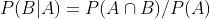
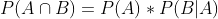
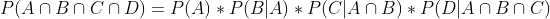
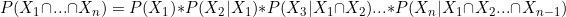
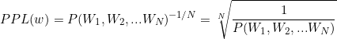
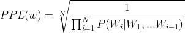
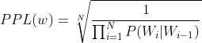

# Basic-Of-NLP
해당 내용은 **"딥 러닝을 이용한 자연어 처리 입문"** 서적을 토대로 공부한 내용을 개인적으로 보기 편하게 정리해놓은 것입니다.    
> link : <https://wikidocs.net/book/2155>    
*  필요 라이브러리    
> tensorflow, keras, scikit-learn, gensim, NLTK, KoNLTK, Pandas, Numpy, Matplotlib     

## 자연어 처리
+ 자연어 : 일상생활의 언어    
+ 자연어처리 : 일상생활의 언어를 컴퓨터가 처리할 수 있도록 하는 일 (ex. 음성인식, 내용 요약, 번역 etc..)    
+ EDA(Exploratory Data Analysis, 탐색석 데이터 분석)
  + 데이터 내 값의 분포, 변수 간 관계, 결측값 존재 유무 등을 파악하는 과정
+ Pandas profiling
  + 방대한 양의 데이터를 탐색(개요, 변수, 상세확인으로 구성)
+ 코퍼스
  + 조사나 연구목적에 의해서 특정 도메인으로부터 수집된 텍스트 집합(txt, csv, xml 등)
+ 머신러닝 워크플로우
    

>출처: [here][herelink]
>
>[herelink]: https://wikidocs.net/31947

## 텍스트 전처리
+ 텍스트 전처리 : 용도에 맞게 텍스트를 사전에 처리하는 작업
### 토큰화 : 주어진 코퍼스에 대해 토큰이라 불리는 단위로 나누는 작업. 
> 토큰의 기준은 데이터의 용도에 따라 사용자가 직접 정의    
> nltk에는 영어 코퍼스를 토큰화 할 수 있는 도구를 제공 (ex. word_tokenize, wordPunctTokenizer ...)

+ 토큰화 고려사항
  + 구두점이나 특수 문자를 단순 제외하면 안된다.
  + 줄임말과 단어 내에 띄어쓰기가 있는 경우, 토큰화는 접어를 펼치는 작업도 포함한다. (I'm -> I am)

+ 한국어 토큰화의 어려움
  + 한국어는 교착어이다.
  + 한국어는 영어보다 띄어쓰기가 잘 지켜지지 않는다.
  
### 품사 태깅
> 토큰화 과정에서 각 단어가 어떤 품사로 쓰였는지 구분하는 과정.
> NLTK는 **Penn Treebank Pos Tags** 기준에 의해 품사태깅.    

|약자|이름|
|------|---|
|PRP|인칭대명사|
|VBP|동사|
|RB|부사|
|VBG|현재부사|
|IN|전치사|
|NNP|고유명사|
|NNS|복수명사|
|CC|접속사|
|DT|관사|

* KoNLPy (한국어 자연어처리)
> okt, 한나눔, 꼬꼬마 etc..    
> 사실은 형태소 단위로 토큰화 (영어는 단어 토큰화)
+ morphs : 형태소 추출
+ pos : 품사 태깅
+ nouns : 명사 추출    
**okt 형태소 분석기와, 꼬꼬마 형태소 분석기의 결과는 다르다**    
**사용하고자하는 용도에 맞게 판단하고 알맞은 현태소 분석기를 사용하자**

### 정제 / 정규화

+ **정제(cleaning)** : 갖고있는 코퍼스로부터 노이즈 데이터를 제거
+ **정규화(Normalization)** : 표현 방법이 다른 단어들을 통합시켜 같은 단어로 만들어줌
> 정제와 정규화는 적당한 합의점을 잡고 합의점에 도달할 때까지 지속적으로 진행한다.
+ 단계
  1. 규칙에 기반한 표기가 다른 단어들의 통합 (ex. 어간 추출, 표제어 추출)
  2. 대,소문자 통합 (ex. Automobile - automobile, But US - us)
  3. 불필요한 단어의 제거
     + 등장 빈도가 적은 단어
     + 길이가 짧은 단어(영어권에서는 효과가 좋다.)
  4. 정규표현식
  
### 표제어 추출 / 어간 추출
+ 표제어 추출 (Lemmatization): 코퍼스의 단어들로부터 기본 사전형 단어를 찾아나감.
  + am, are, is -> be
  + 형태학적 parsing (어간과 접사를 분리)
  > 어간 : 단어의 의미를 담고있는 핵심저긴 부분(cats -> cat)    
  > 접사 : 단어에 추가적인 의미를 주는 부분(cats -> -s)
+ 어간 추출 (Stemming): 눈으로 보았을 때, 서로 다른 단어들이지만 같은 의미를 갖고있는 단어들을 하나의 단어로 일반화.
  + 단순 규칙에 의거한 추출( 경과 단어가 사전에 존재하지 않을 수 있다.)
  + ex. Porter Algorithm ..
+ 표제어 추출 VS 어간 추출
  + 표제어 추출
    + 문맥 고려
    + 수행 시 해당 단어의 품사정보를 보존 (=POS 태그를 보존)
  + 어간 추출
    + 품사정보 보존 X
    + 사전에 존재하지 않는 단어가 출력될 수 있음.
  
* 예시

| |표제어 추출|어간 추출|
|----|----|----|
|am|be|am|
|the going|the going|the go|
|having|have|hav|

+ 한국어에서의 어간 추출
  + 5언 9품사

|언|품사|
|----|----|
|체언|명사, 대명사, 수사|
|수식언|관형사, 부사|
|관계언|조사|
|독립언|감탄사|
|용언|동사, 형용사|

+ 활용 : 용언의 어간이 어미를 갖는 일
  + 어간 : 원칙적으로 모양이 변하지 않는 부분
  + 어미 : 어간뒤에 붙어 용도에따라 변하는 부분
  + 규칙활용 : 어간이 어미를 취할 때 어간의 모습이 일정
  + 불규칙 활용 : 어간이 어미를 취할 때 어간의 모습이 변하거나 어미가 특수한 어미일 경우
    > 불규칙 활용의 경우, 좀 더 복잡한 규칙이 필요하다.

+ 불용어(StopWord)
  + 자주 등장해도 분석에 큰 도움이 없는 단어로 NLTK에서는 불용어 패키지로 특정 단어들을 정의
  + I, my, me, over ...
+ NLTK를 통한 불용어 제거
```
from nltk.corpus import stopwords
stop_words = set(stopwords. words('english'))
```
+ 한국어에서 불용어 제거
  + 사용자가 직접 불용어 사전을 만들어 사용
  + 대표적 불용어 사전 : [here][herelink2]

[herelink2]: https://www.ranks.nl/stopwords/korean

### 정규표현식 (~~re모듈 익히기~~)
> [here][herelink3]

[herelink3]: https://wikidocs.net/21703

+ 정규 표현식을 이용한 토큰화
```
from nltk.tokenize import RegexpToknizer
```
  + 문자열을 기준으로 토큰화
  ```
  tokenizer = RegexpToknizer("[\n]+")
  ```
  > I'm Mr.Ji! -> ['I','m','Mr','Ji']
  + 공백을 기준으로 토큰화
  ```
  tokenizer - RegexpTokenizer("[\s]+", gaps = True) // 다음 정규표현식을 토큰화의 기준으로 쓰겠다.
  ```
  > I'm Mr.Ji! -> ['I'm', 'Mr.Ji!']
  
### 정수 인코딩
> 단어의 빈도수를 기준으로 정렬한 후, 각각에 해당하는 Index의 원소에 1을 대입.    
> 빈수가 높으면, 낮은 Index를 부여. 이 때, 특정 횟수 이하의 숫자는 제거(cleaning작업)    
> 문장의 매핑 과정 중 Index Dict에 존재하지 않는 단어가 존재하면, key는 'OOV'로, Value는 len+1로 추가한다.
+ sent_tokenize -> 문장 단위로 토큰화 진행
+ word_tokenize -> 단어 단위로 토큰화 진행

+ 케라스의 텍스트 전처리
```
from tensorflow.keras.processing.text import Tokenizer
tokenizer = Toknizer()
tokenizer.fit_on_texts(sentence) // 빈도수를 기준으로 단어집합 생성
tokenizer.word_index // 빈도수에 따른 index 부여 Dict
tokenizer.word_count // 단어와 빈고수 Dict
tokenizer.text_to_sequences(sentence) // Mapping된 배열
```
Q. 빈도수를 기준으로 상위 5개만 뽑아내려면?
```
vocab_size = 5
tokenizer = Tokenizer(num_words = vocab_size + 1) // +1인 이유는 0번 Index를 Padding을 위한 공간으로 사용하기 위해
tokenizer.fit_on_texts(sentence)
```
Q. ;OOV를 쓰고 싶다면?
```
vocab_size = 5
tokenizer = Tokenizer(num_words = vocab_size + 2, oob_token = 'OOV') // 'OOV'의 Index는 1로 자동 설정
```
### 패딩 :서로 다른 길이의 문장에 대해 길이를 맞춰주는 작업
```
from tensorflow.keras.processing.sequence import pad_sequences
padded = pad_sequences(encoded) // 기본적으로 앞에 0을 padding
```
Q. 뒤에 0을 padding하고 싶다면?
```
padded = pad_sequences(encoded, padding = 'post')
```
Q. Padding의 길이를 설정하려면?
```
padded = pad_sequences(encoded, padding = 'post', maxlen = 5)
```
Q. 0이 아닌 다른 값으로 padding하려면?
```
last_value = len(tokenizer.word_index) + 1
padded = pad_sequences(encoded, padding = 'post', value = last_value)
```

+ 원 핫 인코딩
> 단어 집합 : 서로 다른 단어들의 집합 (ex. book, books)
  1. 각 단어에 고유한 인덱스를 부여. (정수 인코딩)
  2. 표현하고 싶은 단어의 인덱스의 위치에 1을 부여하고, 다른 위치에는 0을 부여.
  ```
  from tensorflow.keras.utils import to_categorical
  ```
+ 한계
  + 단어의 갯수가 늘어날수록, 벡터의 크기는 계속 커진다. ( = 벡터의 차원이 계속 능어난다.)
  + 단어의 유사도를 표현하지 못한다.
+ 보완 방법
  + 카운트기반 벡터화(LSA, HAL etc..)
  + 예측기반 벡터화(NNLM, RNNLM, Word2Vec, FastText etc..)
  + 두 개를 합한 벡터화(Glove etc..)
  
## 언어 모델(Language Model)
> 단어 시퀀스에 확률을 할당하는 모델    
+ 통계를 이용하는 방법
+ 인공 신경망을 이용하는 방법.(GPT, BERT etc..)
> 최근에는 통계를 이용한 모델보다는 인공 신경망을 이용한 모델이 더 발전
> 대부분 [앞단어]를 통해 [뒷단어]를 예측
### 언어 모델링 : 주어진 단어들로부터 아직 모르는 단어를 예측하는 작업.
+ 목적
1) 기계 번역
2) 오타 교정
3) 음성 인식

### 통계적 언어 모델(Statistical Language Model, SLM)
  + 조건부 확률 : A라는 사거니 일어났을 때, B라는 사건이 일어날 확률
  
  
  
  
  
  By Chain Rule..
  
  
  
  Generalize..
  
  
> 문장에 대한 확률에도 조건부 확률을 적용
+ 카운트 기반의 접근
  +  오늘 일찍 일어났어야' 다음 '했는데'가 나올 확률은?    
  > P(했는데|오늘, 일찍, 일어났어야) = count(오늘 일찍 일어났어야 했는데) / count(오늘 일찍 일어났어야) = 30번 / 100번 = 30%

+ 카운트 기반 접근의 한계 (희소문제, Sparsity problem)
  + 현실에서의 확률 분포로 근사하는 언어모델을 만들기 위해서는 방대한 양의 코퍼스 데이터가 필요하다.    
  + 즉, 희소문제 : 충분한 데이터를 관측하지 못하여 언어를 정확히 모델링하지 못하는 문제
+ 해결법
> N-gram, 스무딩, 백오프 etc..    
> 인공 신경망 기반 언어 모델

### N-gram 언어 모델
> 카운트에 기반한 통계적 접근 + 이전에 등장한 모든 단어 대신, 일부 단어만 고려 (N-gram의 N을 의미)

|SLM|N-gram|
|---|---|
|P(했는데\|오늘 일찍 일어났어야)|P(했는데\|했어야)|
+ N-gram 장점
1) SLM의 코퍼스에 문장이나 단어가 없는 경우 해소
2) SLM의 문장이 길어질 때 코퍼스에 문장이 없는 경우 해소
+ N-gram
> 갖고있는 코퍼스에서 n개의 단어 뭉치로 끊어 이를 하나의 토큰으로 간주.
+ 'I am a good boy'

||set|
|---|---|
|unigrams|I, am, a, good, boy|
|bigrams|I am, am a, a good, good boy|
|trigrams|I amd a, am a good, a good boy|
|4- grams|I am a good, am a good boy|

+ I am a good **W**
> In 3-gram, P{W|a good) = count(a good W) / count(a good)    
+ N-gram 언어 모델의 한계
> 전체 문장을 고려한 언어 모델보다는 성능이 떨어진다.
  + 희소문제
  > SLM보다 count될 확률이 높아질 뿐, 희소문제는 여전히 존재.
  + n 선택에서의 trade off(교환)    
  
  ||성능|count|모델 SIZE|
  |---|---|---|---|
  |n이 증가|향상|감소|증가|
  |n이 감소|하락|증가|감소|
  > n은 최대 5를 넘어서면 안된다!
+ 적용 분야에 맞는 코퍼스 수집
  + 마케팅 분야 vs 의료 분야의 확률 분포는 다르다.
  + 원하는 도메인의 코퍼스를 활용하여 언어모델 개발
  
+ 인공신경망을 이용한 언어모델. (Neural Network Based Language Model)
  + N-gram 언어 모델보다 대체적으로 성능이 우수한 인공신경망 기반 언어모델 사용 증가.
  
+ 한국에서의 언어모델
  1. 어순이 중요하지 않다.
  > 오늘 나는 기분이 좋다.    
  > 나는 오늘 기분이 좋다.    
  > 오늘 기분이 좋다.    
  > 기분이 나는 좋다.    
  2. 한국어는 교착어이다.    
  나 : 나는, 나를, 나의, 나에게, 나로써
  > 토큰화를 통해 접사나 조사 등을 분리해야 한다.
  3. 한국어는 띄어쓰기가 제대로 지켜지지 않는다
  > 띄어쓰기를제대로하지않아도의미전달이가능하다.
### 퍼플렉서티(Perplexity)
+ 외부평가 : 모델의 외부에서 모델에 대한 평가를 진행. (모델의 성능비교 등)
+ 내부평가 : 모델의 내부에서 모델 자체가 모델에 대한 평가를 진행. (Perplexity 등)

+ 언어모델의 평가 방법 : PPL



By Chain Rule..



If Bigram




+ 분기계수(Branching Factor)
  + PPL은 선택가능한 경우의 수를 의미하는 분기계수이다.
  + PPL이 낮으면 성능이 더 좋다. 단, 사람이 느끼기에 좋은 언어모델은 아닐 수 있다.
  + 두 모델에 대해 PPL로 비교할 때, 같은 도메인에 동일한 테스트케이스를 사용해야 한다.
> 페이스북 AI연구팀이 공개한 자료에 따르면, 대부분 기존 언어모델보다 인공신경망 모델의 PPL이 더 낮다(= 성능이 우수하다).

+ DTM(Document-Term-Matrix)
  + 다수의 문서에서 등장하는 각 단어의 빈도수만을 원소로 갖는 행렬
  + 한계
    + 희소 표현 (Sparse representation)
      + 공간적 낭비와 계산 리소스를 증가킨다.
    + 빈도수 기반 접근
      + 문서(문장) 자체의 유사도를 판단할 수 없음 ex/ 나는 너를 좋아해, 나는 너를 안 좋아해
+ TF-IDF(Term Frequency-Inverse Document Frequency)
  + DTM에 단어의 중요도(가중치)를 포함해 계산한 행렬
  + TF : 특정 문서에서 특정 단어의 등장 횟수
  + DF : 전체 corpus에서 특정 단어가 등장한 문서의 개수
  + idf : DF에 반비례하는 수    
  
  
  > idf 계산 중 log를 사용하는 이유 : 문서n의 개수에 따라 한없이 커지는 idf값을 조정하기위해
+ **TF-IDF가 항상 DTM보다 좋은 결과를 내지는 않는다.**

+ 토픽 모델링
  + 문서 집합 사이의 추상적인 주제를 발견하기위한 통계적 모델
  + LSA vs LDA
    + LSA : Latent Semantic Analysis (잠재 의미 분석)
      + using SVD
      + 한계 : 새로운 데이터가 들어오면 처음부터 다시 계산해야함
    + LDA : Latent Dirichlet Analysis (잠재 디리클레 분석)
      + 가정: 문서는 topic의 혼합, 데이터가 주어지면 문서 생성과정의 역추적
      
    
## 워드 임베딩(Word Embedding)
> 자연어를 컴퓨터가 이해하기 쉬운 벡터 형식으로 변환하는 작업(Word2Vec, Glove)  

+ 희소 표현(Sparse Representation)
  + 표현식의 대부분의 값이 0
  + 자원 낭비
  + ex. 원 핫 인코딩, DTM
+ 밀집 표현(Dense Representation)
  + 단어를 정해진 크기로 표현
  + 밀집 표현을 통한 단어 표현을 __워드 임베딩(Word Embedding)__이라함
  + 워드 임베딩을 표현을 통한 결과를 __임베딩 벡터(Embedding Vector)__라 함

+ Word2Vec
  + __'비슷한 위치에서 등장하는 단어들은 비슷한 관계를 가진다'__
  + Projection Layer를 통해 학습, activation layer X
  + 대부분 Skip-gram이 CBOW보다 성능이 좋음  
  
  + CBOW(Continuous Bag Of Words)
    + 주변에 위치한 단어(context word)로 중심 단어(center word) 예측
    + context word들의 Projection Layer 연산 결과(=output vector)의 평균값을 사용
    + 몇개의 주변 단어를 볼것인지 윈도우(window)를 통해 결정
    + window size = n -> context word size = 2n (앞 n개, 뒤 n개)  
  
  + Skip-gram
    + 중심단어(center word)를 통해 주변 단어(contecxt layer)를 예측
    + output vector가 하나만 나오므로 평균을 계산할 필요가 없음  
  
  + NNLM과의 차이점
    + NNLM은 이전 단어만 활용하여 단어를 예측(Word2Vec은 이전 단어와 이후 단어를 모두 사용)
    + NNLM은 input layer - hidden layer - projection layer - output layer(Word2Vec은 input layer - projection layer - output layer)
    
  
